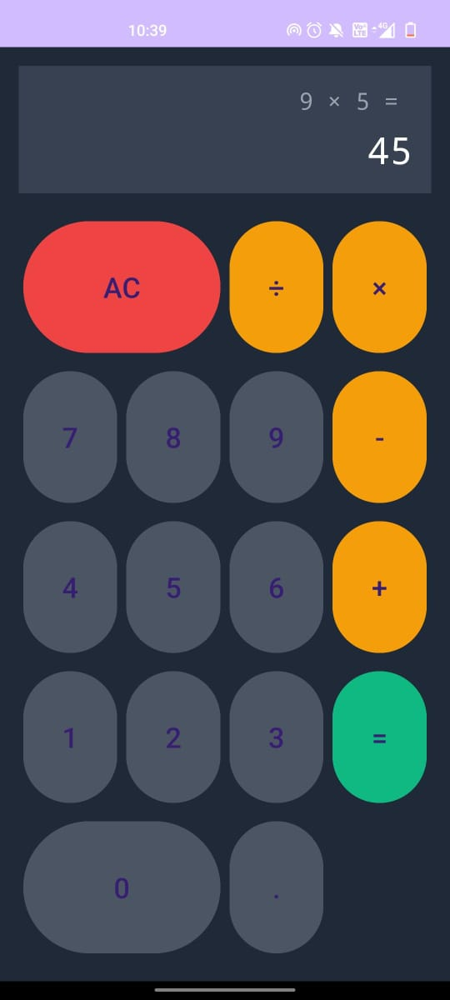

# 🧮 **Easy Calcy**  
### A Simple and User-Friendly Calculator App  

---

## 📝 **Overview**  
**Easy Calcy** is a fully functional and user-friendly calculator application designed for performing basic arithmetic operations. This app was developed as part of my **Android Development Internship** at **Prodigy InfoTech**.  

---

## ✨ **Features**  
✅ Clean and intuitive user interface for smooth usability.  
✅ Supports basic arithmetic operations:  
   - **Addition (+)**  
   - **Subtraction (-)**  
   - **Multiplication (\×)**  
   - **Division (÷)**  
✅ Real-time display of entered operations (e.g., `1 + 3`).  
✅ Backspace button to correct user input.  

---

## 📸 **Screenshots**  
<p align="center">  
      
</p>  

 

---

## 🛠️ **Technologies Used**  
- **IDE**: Android Studio  
- **Language**: Java  
- **UI Design**: XML  

---

## 🚀 **How to Use**  
1. Download and install the app on your Android device.  
2. Open **Easy Calcy**.  
3. Use the on-screen buttons to perform basic calculations.  
4. Use the **backspace button** to edit your inputs.  

---

## ⚙️ **Setup Instructions**  
To clone and run this project on your local machine:  

1. Install **Android Studio**.  
2. Clone this repository:  
   ```bash  
   https://github.com/thirusudar03092003/PRODIGY_AD_01.git 
   ```  
3. Open the project in **Android Studio**.  
4. Build and run the application on an emulator or physical device.  

---

## 🙌 **Credits**  
- **Developed by**: Thiru Sudar S L
- **As part of**: Prodigy InfoTech Android Development Internship  

---
